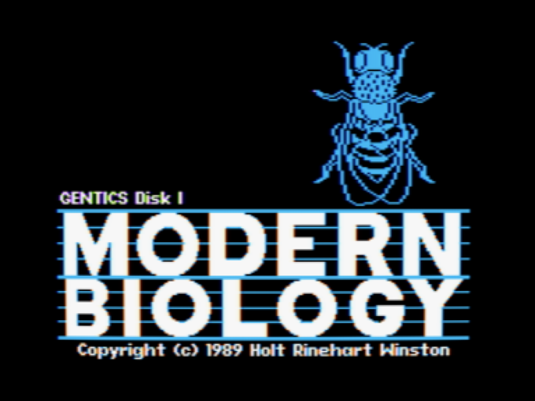
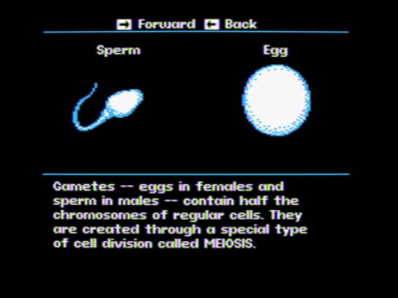
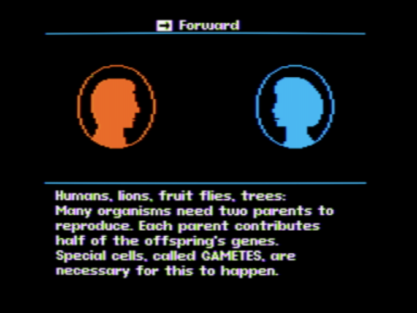

# AppleII-genetics
Apple II source code, in the Forth language, for a commercial genetics educational program

This is the source code for Modern Biology: Genetics, a program for the Apple II computer released by Holt Rinehart Winston in 1989. The source was released with the MIT license in 2021 by Lloyd Prentice, the president of Prentice Associates, Inc., the company that produced the software.

You can run the program in your browser here: https://archive.org/details/wozaday_Modern_Biology_Genetics

